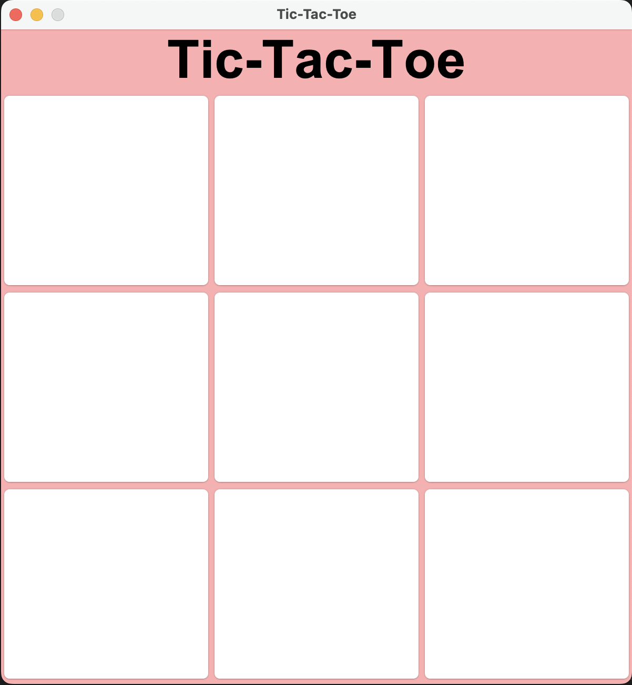
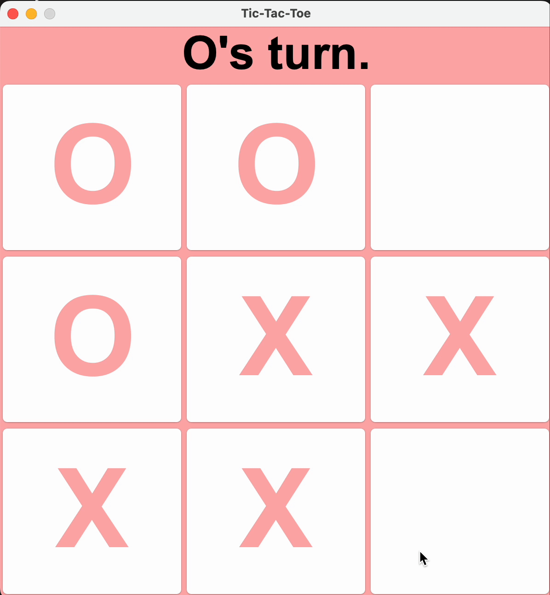
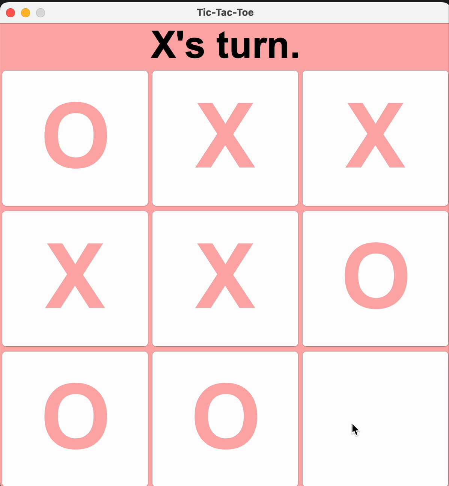

# TicTacToe Game
TicTacToe Game is a classic tic-tac-toe application built in Java as a university project.
Two players compete by taking turns until one of them wins or the game ends in a draw.

## Features

- Two-player gameplay – X and O take turns.

- 3x3 board – maximum of 9 moves per game.

- Win conditions – the app checks all possible winning patterns (rows, columns, diagonals).

- Draw detection – if no one wins after 9 moves, the game ends in a tie.

- Validation – ensures the moves are correct and the game flow is valid.

## Screenshots

### Main view

### Winner

### Tie

